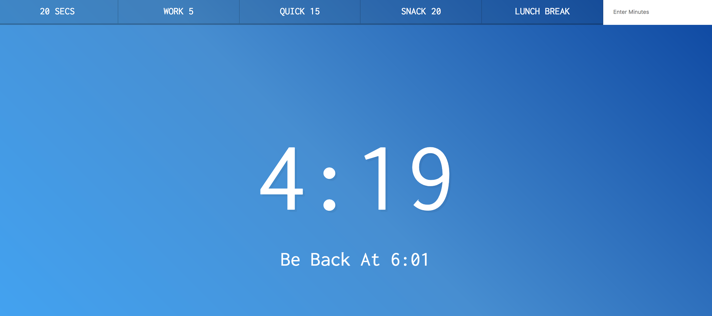

## JavaScript30 Day 29 - Countdown Timer

In this tutorial, we are learning how to code a countdown timer that will show us how much time left in some sort of task.

[View demo site here.](https://webdevtuts.github.io/javascript30_29/)

